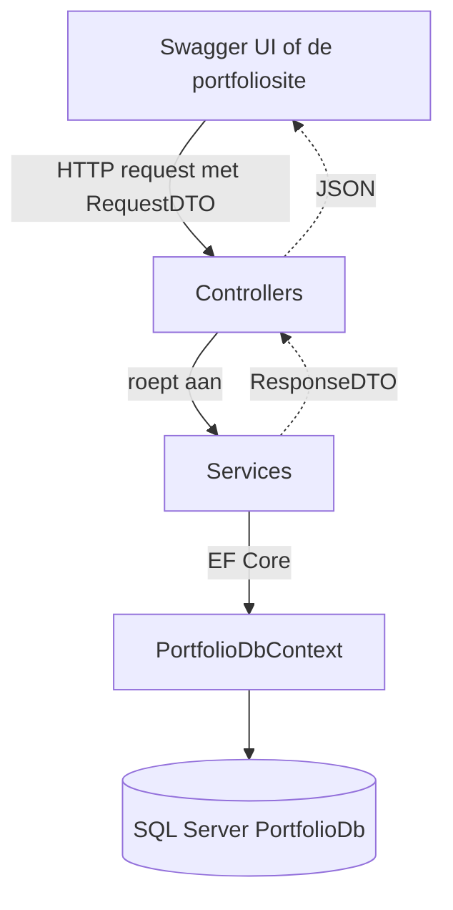

# portfolio api

> uitsluitend deze readme is opgesteld met behulp van Claude. de code heb ik zelf geschreven.

de backend van mijn portfoliosite. een ASP.NET Core Web API (.NET 10) met controllers, EF Core en SQL Server. je kan projecten en blogposts aanmaken, ophalen, wijzigen en verwijderen.

## starten

je hebt .NET 10 en een SQL Server op localhost nodig. de connection string staat in `appsettings.json`.

```bash
cd EersteWebNetApplicatie
dotnet ef database update
dotnet run
```

daarna staat swagger op http://localhost:5029/swagger

## database

ik gebruik een migratie en geen EnsureCreated. de migratie staat in de map `Migrations` (`EersteMigratie`) en met `dotnet ef database update` wordt de database `PortfolioDb` aangemaakt met de tabellen `Projects` en `Blogposts`.

ik heb voor een migratie gekozen omdat ik dan later een veld kan toevoegen zonder dat ik de hele database weg moet gooien. met EnsureCreated kan dat niet.

## endpoints

| methode | route | wat |
| --- | --- | --- |
| GET | `/Projects` | alle projecten |
| GET | `/Projects/{id}` | een project |
| POST | `/Projects` | project aanmaken |
| PUT | `/Projects/{id}` | project wijzigen |
| DELETE | `/Projects/{id}` | project verwijderen |
| GET | `/BlogPost` | alle blogposts |
| GET | `/BlogPost/{id}` | een blogpost |
| POST | `/BlogPost` | blogpost aanmaken |
| PUT | `/BlogPost/{id}` | blogpost wijzigen |
| DELETE | `/BlogPost/{id}` | blogpost verwijderen |

## lagen



| map | wat doet het |
| --- | --- |
| `Controllers` | pakt het HTTP request aan en stuurt de juiste statuscode terug (200, 201, 404). weet niks van de database |
| `Services` | de logica. haalt data op via de DbContext en zet een model om naar een DTO. weet niks van HTTP |
| `Models` | `Project` en `Blogpost`, dit zijn de tabellen in de database |
| `DTO's` | wat de api binnenkrijgt (request) en terugstuurt (response) |
| `PortfolioDbContext` | de verbinding met SQL Server via EF Core |
| `Migrations` | de migratie die de database aanmaakt |

## onderbouwing

**waarom controllers en geen Minimal API**

ik heb voor controllers gekozen omdat we daar in les 5 mee begonnen zijn en ik het dan het beste begrijp. elke controller is een eigen class met alle routes van een onderdeel bij elkaar, dus alles van projecten staat in `ProjectsController` en alles van blogposts in `BlogPostController`. dat vind ik overzichtelijk.

bij Minimal API maak je geen controller classes. je zet de routes direct in `Program.cs` met `app.MapGet`, `app.MapPost` enzovoort en je krijgt de service binnen als parameter in plaats van via de constructor. dat is minder code en sneller opgezet, maar met 10 endpoints wordt `Program.cs` snel vol als je het niet zelf goed groepeert. voor een kleine api is het prima, ik vond controllers alleen duidelijker om mee te leren.

**waarom lagen**

de controller doet alleen HTTP en de service doet alleen de logica en de database. als ik iets aan de database verander hoef ik de controller niet aan te passen en andersom. het is ook makkelijker zoeken: gaat er iets mis met een statuscode dan kijk ik in de controller, gaat er iets mis met de data dan kijk ik in de service.

voor een portfoliosite met twee onderdelen is dit genoeg. verticale features zou ik pas doen als het project veel groter wordt.

**waarom DTO's**

de api stuurt nooit een `Project` of `Blogpost` direct terug. die classes zijn mijn tabellen. als ik daar later een veld aan toevoeg dat niemand mag zien, zou dat anders automatisch mee naar buiten gaan. met een DTO kies ik zelf wat erin en eruit gaat. de request DTO heeft geen ID omdat de database die zelf maakt, de response DTO heeft die wel.

**dependency injection**

de DbContext en de twee services staan geregistreerd in `Program.cs`. de controller krijgt de service via de constructor en de service krijgt de DbContext via de constructor. ik maak nergens zelf een DbContext aan met `new`.
